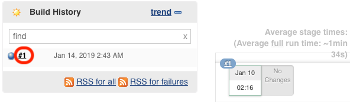
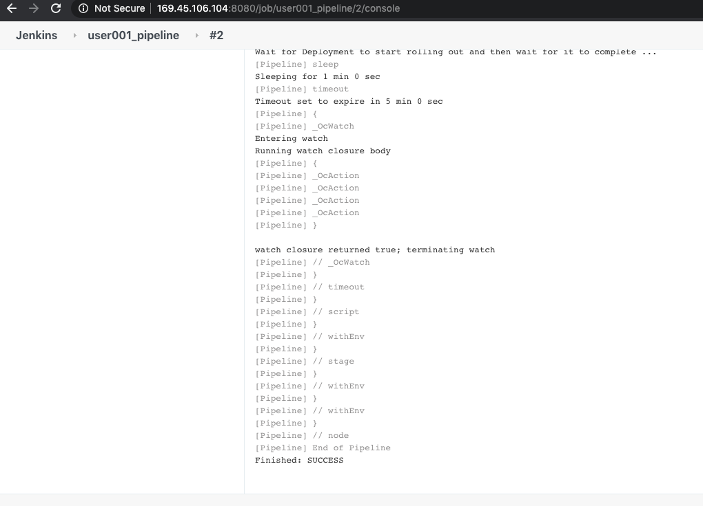

# IBM Client Developer Advocacy App Modernization Series

## Lab - Automated updates of containerized applications from SCM commits

### Creating a CI/CD Pipeline for deployment to OpenShift  using Jenkins

## Overview

In this lab you will  be connecting your Git repository with the Plants by WebSphere app to a Continuous Integration/Continuous Deployment pipeline built with Jenkins that will deploy to an OpenShift cluster.

## Setup

If you haven't already:

Complete the lab exercise *S2I and Template Lab for the App Modernization Dojo on OpenShift in a shared environment* by following the instructions [here](https://github.com/IBMAppModernization/app-modernization-openshift-templates-lab-shared)

### Step 1: Clone the Github repo that contains the code for the Plants by WebSphere app

1.1  Login in [your Github account](https://github.com)

1.2  In the search bar at the top left type in `app-modernization-plants-by-websphere-jee6`

   

1.3  Select the repository `IBMAppModernization\app-modernization-plants-by-websphere-jee6` and then click on the **Fork** icon

1.4  Click the **Clone or download** button from your copy of the forked repo and copy the HTTPS URL to your clipboard

   

1.5  From the client terminal window clone the Git repo  with  the following commands  appending the HTTPS URL from your clipboard

    ```text
    git clone [HTTPS URL for NEW REPO]
    cd app-modernization-plants-by-websphere-jee6
    ```

### Step 2: Install Jenkins in your OpenShift cluster

2.1 Open the OpenShift web console in your browser

2.2 Make sure you're in the project from the previous lab e.g. *pbw-user012*  (top left) and click on **Add to Project -> Browse Catalog** (top right)

   

2.3 Select the **CI/CD** category and click on **Jenkins (Ephemeral)**

   

2.4 Click **Next**, then click **Next** again. Click **Create anyway** when prompted with a warning

2.5 Click **Continue to the project overview**

2.6 Wait for the pods for Jenkins shows as running (note this may take a few minutes)

   

### Step 3: Create Pipeline from a template

3.1  From the terminal run the following command to install the Plants by WebSphere pipeline template (note: you need to be in the top level folder of the cloned  Plants by WebSphere GitHub repo i.e. **app-modernization-plants-by-websphere-jee6**

   ```bash
   oc create -f openshift/templates/pbw-liberty-cicd-pipeline.yaml
   ```
3.2 In your Web console browser tab make sure you're in the **pbw-liberty-mariadb** project (top left) and click on **Add to Project -> Browse Catalog** (top right)

3.3 Select the **Other** category and then click **Plants by WebSphere on Liberty CI/CD Pipeline**

3.4 Click **Next**. Change the **Source URL** to the url of your clone of the Plants by WebSphere repo

   

3.5 Click **Create** and then click **Continue to the project overview**

### Step 4: Manually trigger a build to test pipeline

4.1 In your Web console browser tab select **Build -> Pipelines**

  

4.2 Click on **Start Pipeline**

  

4.3 Once the Pipeline starts click on **View Log**. This will take you into Jenkins and display the Jenkins log for the pipeline. (Note: you may be prompted to use your OpenShift credentials for Jenkins)

   

4.4 Verify that the pipeline runs without errors. You should see output like the following:

   

### Step 5: Trigger a build via a commit to Github

The BuildConfig for your pipeline is  already configured to be triggered by a Github webhook

5.1 In your Web console browser tab select the **pbw-cicd-pipeline**

  

5.2 Click on the **Configuration** tab and then click on the icon next to the **GitHub Webhook URL** to copy it to the clipboard

  

5.3 In another browser tab go to https://github.com and select your cloned Plants by WebSphere repository

5.4  Click on the repository settings

   

5.5 Under **Options** select **Webhooks** and click **Add webhook**

   

5.6  For the Payload URL paste in the URL you copied to your clipboard in step 5.2

Change content type to **application/json**

5.7 Change **SSL Verification** to **Disable**

5.8  Accept the other defaults and click **Add webhook**

   

5.9 In the Github file browser drill down to *pbw-web/src/main/webapp/promo.xhtml*

5.10  Click on the pencil icon to edit **promo.xhtml**  and on line 95 locate the price of the Bonsai Tree

5.11  Change  `$30.00 each` to `<strike>$30.00</strike> $25.00 each`

   This will show the price of the Bonsai Tree as being reduced even more

   

5.12 At the bottom of the UI window add a commit message and click on **Commit changes**

5.13 Switch back to your OpenShift console and open the **pbw-cicd-pipeline**

5.14 Verify that your pipeline  starts building.

   

5.15 Once the pipeline has completed select **Applications -> Routes** from  the left navigation menu

   

5.16 Click on the hostname link for **pbw-liberty-mariadb** to launch the Plants by WebSphere app

5.17 Verify that the price of the bonzai tree has changed.

  

## Summary

You created a Jenkins pipeline from within OpenShift to automatically build and deploy an app that has been updated in Github .
